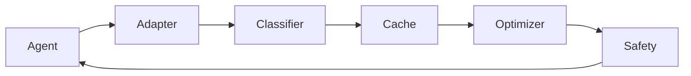

# Architecture

## Overview

Tokn't is a local-first token optimization layer that sits between AI coding agents and the model.



## Core Loop

```
OBSERVE → DETECT REDUNDANCY → COMPRESS SAFELY → CACHE ORIGINAL
→ PROVIDE RECALL → MEASURE SAVINGS → VERIFY CORRECTNESS
```

## Monorepo Structure

```
toknt/
├── apps/
│   ├── cli/              # toknt CLI
│   └── observatory/      # Benchmark visualization portal
├── packages/
│   ├── core/             # Engine, classifier, safety, metrics
│   ├── cache/            # Content-addressed local cache
│   ├── optimizer/        # Compression strategies
│   ├── tokenizer/        # Token estimation
│   ├── benchmark/        # Benchmark engine
│   └── adapters/         # Agent adapter interface
├── integrations/
│   ├── claude/           # Claude Code adapter
│   ├── cursor/           # Cursor adapter
│   └── codex/            # Codex adapter
├── plugins/
│   └── cursor/           # Cursor plugin (hooks, skills, rules)
└── benchmarks/
    ├── tasks/            # Benchmark task definitions
    └── fixtures/         # Test repositories
```

## Components

### Classifier

Assigns safety levels to context items:

- `CRITICAL` — never compress
- `IMPORTANT` — pass through
- `NORMAL` — default
- `STALE` — potentially compress (aggressive mode)
- `DUPLICATE` — safe to compress
- `RECOVERABLE` — compress with recall URI

### Cache

Content-addressed storage at `~/.toknt/`:

```
~/.toknt/
├── cache/        # File content
├── outputs/      # Terminal output
├── indexes/      # Directory listings
├── sessions/     # Session data
├── benchmarks/   # Benchmark results
└── config.json   # Configuration
```

Recall URIs: `toknt://file/abc123`, `toknt://output/def456`

### Optimizers

| Strategy | Trigger | Action |
|---|---|---|
| Duplicate file | Same path + same hash | Replace with reference |
| Terminal output | >100 lines | Summarize failures |
| Directory listing | >50 entries | Tree summary |
| Duplicate tool output | Same hash | Reference previous |

### Safety Validator

- Secret detection and redaction
- Mode-aware compression eligibility
- Pass-through on uncertainty

### Metrics Engine

Tracks estimated tokens (not billing data):

- Original vs optimized tokens
- Savings breakdown by strategy
- Compression and recall counts

## Agent Adapters

```typescript
interface AgentAdapter {
  name: string;
  detect(): Promise<AgentInfo>;
  install(): Promise<void>;
  uninstall(): Promise<void>;
  interceptToolOutput?(output: ToolOutput): Promise<ToolOutput>;
}
```

Each adapter is fully isolated. The core never imports agent-specific code.

## Data Flow

1. Agent executes a tool (read file, run command, list directory)
2. Adapter intercepts the tool output
3. Classifier determines safety level
4. Safety validator approves or rejects compression
5. Optimizer compresses if safe
6. Original stored in local cache
7. Compressed content returned to agent
8. Agent can recall full content via URI

## Design Principles

1. **Never optimize at the expense of correctness**
2. **Local-first — no data leaves the machine**
3. **Deterministic optimizations — no LLM required**
4. **Every compression is recoverable**
5. **When uncertain, pass through**
