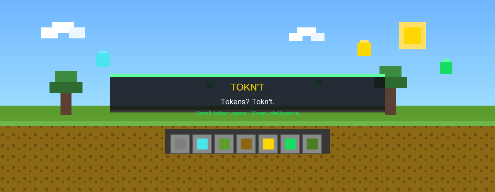

<div align="center">

<!-- Banner: PNG for GitHub README (SVG animations blocked by GitHub camo) -->
<a href="https://shubhransh-gupta.github.io/toknt/">
  
</a>

# Tokens? Tokn't.

**Smelt the token waste. Keep the intelligence.**

<br />

[](https://github.com/shubhransh-gupta/toknt/stargazers)
[](LICENSE)
[](https://github.com/shubhransh-gupta/toknt/actions)
[](CONTRIBUTING.md)

<br />

**Local-first token optimization for Claude Code · Cursor · Codex · Windsurf**

<br />

[](https://github.com/shubhransh-gupta/toknt/stargazers)
[](docs/reduce-token-cost.md)
[](https://shubhransh-gupta.github.io/toknt/#setup)
[](docs/getting-started.md)

</div>

<br />

<div align="center">

> **Your AI agent keeps mining the same block. Stop paying for duplicate ore.**

<br />

[](https://github.com/shubhransh-gupta/toknt/stargazers)
[](https://github.com/shubhransh-gupta/toknt/discussions)

**Using Cursor, Claude Code, or Codex daily?** If Tokn't cuts your token bill, **[⭐ star the repo](https://github.com/shubhransh-gupta/toknt/stargazers)** so other builders find it.

</div>

<br />

<div align="center">

<table>
  <tr>
    <td align="center" width="340">

### 🪨 Raw ore
*balanced mode · measured*

**38,216** tokens  
*(tiktoken)*

    </td>
    <td align="center" width="80">

### ⬇️
**91.5%**  
*smelted*

    </td>
    <td align="center" width="340">

### 💎 Refined ingot
*balanced mode · measured*

**3,236** tokens  
*(tiktoken)*

    </td>
  </tr>
</table>

*Default `safe` mode: **~6.5%** · Real repo duplicate reads: **~46%** · [Full stats ↓](#-achievement-log-honest-stats)*

<br />

[](https://shubhransh-gupta.github.io/toknt/)
[](docs/reduce-token-cost.md)

</div>

---

<div align="center">

## ⛏️ Why crafters are starring this

</div>

<div align="center">

| Mob problem | Tokn't enchantment |
|:--|:--|
| Agent rereads the same file 5× | Hash-based dedup + recall |
| `npm test` dumps 12K lines into context | Summarize failures, store full output locally |
| `find .` sends 40K filenames to the model | Tree summary + searchable local index |
| Identical grep results repeated | Content-hash caching |
| Token counters that *tell* you waste | **Actually smelts** what hits the model |

*Not another scoreboard — a performance layer. Efficiency III for your agent.*

</div>

---

<div align="center">

## 💎 How to configure & reduce token cost

**[→ Full guide: docs/reduce-token-cost.md](docs/reduce-token-cost.md)** · **[→ Live walkthrough](https://shubhransh-gupta.github.io/toknt/#setup)**

</div>

<div align="center">

| Step | What to do |
|:--:|:--|
| **1** | `git clone … && npm install && npm run build` |
| **2** | `npx toknt install cursor` *(or claude / codex)* |
| **3** | `npx toknt config set mode balanced` |
| **4** | Code normally — Tokn't compresses tool output automatically |
| **5** | `npx toknt stats` — track your savings |
| **6** | `npx toknt recall toknt://file/abc123` — restore full content |

</div>

<div align="center">

| Mode | Best for | Measured savings* |
|:--|:--|:--|
| **`safe`** | Duplicate files & tool output | **~6.5%** mixed · **~46%** duplicate reads |
| **`balanced`** | Big test logs & directory listings | **~91.5%** on log-heavy sessions |
| **`aggressive`** | Experiments only | Higher · may affect quality |

```json
{ "mode": "balanced", "integrations": { "cursor": true } }
```

*Restart your agent after changing mode.*

</div>

---

<div align="center">

## 🛠️ Crafting table — 60-second install

</div>

```bash
git clone https://github.com/shubhransh-gupta/toknt.git
cd toknt && npm install && npm run build
npx toknt install          # detects Cursor, Claude Code, Codex
npx toknt status           # verify
```

<div align="center">

*Or `npx toknt install` after npm publish*

</div>

---

<div align="center">

## 🔥 Smelting demo

</div>

```bash
npx toknt benchmark --task fix-authentication
npx toknt stats
npm run dev -w @toknt/observatory   # local animated dashboard
```

<div align="center">

[](https://shubhransh-gupta.github.io/toknt/)

</div>

---

<div align="center">

## 🗺️ How the redstone works

</div>

```
Claude Code ─┐
Cursor      ─┼─→  TOKN'T  ─→  Optimized Context  ─→  AI Agent
Codex       ─┘       │
                     ├── Deduplicate (hash files & tool output)
                     ├── Compress (terminal, directories)
                     ├── Cache locally (~/.toknt/)
                     └── Recall (toknt://file/abc123)
```

<div align="center">

🛡️ **Local survival mode** — never compresses secrets, diffs, or errors · your code stays on your machine

</div>

---

<div align="center">

## 📜 Achievement log (honest stats)

*2,000 automated quests · tiktoken cl100k_base · [`accuracy-2000.json`](benchmarks/results/accuracy-2000.json)*

</div>

<div align="center">

| Metric | Result |
|:--|:--|
| **Overall pass rate** | **2000/2000 (100%)** ✓ |
| **Recall integrity** | **1055/1055 (100%)** ✓ |
| **Critical/secret passthrough** | **400/400 (100%)** ✓ |
| **Reduction % vs tiktoken** | **~4pp avg delta** |
| **Absolute token counts** | **~27.5% avg underestimate** |

| Category | Cases | Result |
|:--|--:|:--|
| Duplicate file reads | 350 | 350/350 ✓ |
| Terminal output | 350 | 350/350 ✓ |
| Directory listings | 350 | 350/350 ✓ |
| Duplicate tool output | 200 | 200/200 ✓ |
| Critical content | 250 | 250/250 ✓ |
| Secret detection | 150 | 150/150 ✓ |
| File invalidation | 200 | 200/200 ✓ |
| Token estimator | 150 | 150/150 ✓ |

*Reproduce: `npm run audit:2000`*

</div>

---

<div align="center">

## 📦 Command chest

</div>

```bash
toknt install | stats | benchmark --export run.json | recall <uri> | doctor
```

<details>
<summary><div align="center"><strong>⛏️ All commands</strong></div></summary>

<div align="center">

| Command | Description |
|:--|:--|
| `toknt install [agent]` | Install for claude, cursor, codex, windsurf |
| `toknt stats --json` | Token savings breakdown |
| `toknt benchmark` | Before/after comparison |
| `toknt recall <uri>` | Retrieve compressed content |
| `toknt cache clear` | Reset local cache |

</div>

</details>

---

<div align="center">

## 🤝 Multiplayer — we need builders

[](https://github.com/shubhransh-gupta/toknt/labels/good%20first%20issue)

| Biome | Starter quest |
|:--|:--|
| `packages/core` | Safety classification rules |
| `packages/optimizer` | Jest / pytest parsers |
| `integrations/` | Cursor / Claude hooks |
| `apps/observatory` | UI & animations |
| `benchmarks/` | New benchmark tasks |

**`main` is protected** — PRs required, CI must pass · [.github/BRANCH_PROTECTION.md](.github/BRANCH_PROTECTION.md)

[CONTRIBUTING.md](CONTRIBUTING.md) · [ROADMAP.md](ROADMAP.md)

</div>

**`main` is protected** — PRs required, CI must pass. See [.github/BRANCH_PROTECTION.md](.github/BRANCH_PROTECTION.md).

---

<div align="center">

## 📚 Map & scrolls

| Scroll | Description |
|:--|:--|
| **[Reduce token cost](docs/reduce-token-cost.md)** | Setup, modes, daily usage |
| [Architecture](ARCHITECTURE.md) | System design |
| [Benchmarks](BENCHMARKS.md) | Methodology |
| [Getting Started](docs/getting-started.md) | Install guide |

<br />

**Same agent. Same quest. Less context. More XP.**

*Tokens? Tokn't.* ⛏️ 💎 🟩

<br />

**Created with ❤️ by [Shubhransh Gupta](https://github.com/shubhransh-gupta)**

<br />

### ⭐ Support Tokn't

Tokn't is free, local-first, and MIT-licensed. A GitHub star helps other Cursor/Claude/Codex users discover it:

**[→ Star toknt on GitHub](https://github.com/shubhransh-gupta/toknt/stargazers)** · **[→ Ask a question in Discussions](https://github.com/shubhransh-gupta/toknt/discussions)**

<br />

MIT — [LICENSE](LICENSE)

</div>
